# Personal Portfolio Website V2 🚀

> "Why did the developer go broke? Because he used up all his cache!"

Live at [akshaygupta.live](https://akshaygupta.live) - Where code meets creativity, and bugs come to die.

## 🛠️ Tech Stack

Because one framework is never enough:

- **Next.js 15** (Making SEO great again!)
- **React 19** (Because 18 was so last year)
- **TypeScript** (JavaScript with a safety helmet)
- **Sass** (CSS with superpowers)
- **Bootstrap 5** (For when you need to look good fast)
- **FontAwesome** (Icons that speak louder than words)
- **Web Audio API** (Making waves, literally!)
- **TanStack Form** (Form handling with superpowers)
- **React Hot Toast** (Notifications that look good enough to eat)
- **Typed.js** (Making text come alive)
- **Devicon** (Tech icons for the win)
- **Zod** (Runtime type checking and validation)
- **Styled Components** (CSS-in-JS with component styling)
- **Sanitize HTML** (Keeping user inputs clean and safe)
- **React Syntax Highlighter** (Beautiful code blocks in blog posts)
- **Portable Text** (Rich text rendering from Sanity CMS)
- **Drizzle ORM** (Type-safe database operations)
- **Neon Database** (Serverless PostgreSQL for reactions)
- **Microsoft Clarity & Google Analytics** (Keeping track of who's watching)
- **ESLint & Prettier** (Because clean code is happy code)
- **Next Bundle Analyzer** (Keeping our bundles in check)

### 🌟 Special Ingredients

- [Resend](https://resend.com) - For emails that actually reach inboxes
- [Sanity.io](https://www.sanity.io) - Where my blog posts live their best life
- [AWS S3](https://aws.amazon.com/s3/) - For reliable and scalable music storage
- [AWS CloudFront](https://aws.amazon.com/cloudfront/) - Making music streaming fast worldwide
- [Upstash Redis](https://upstash.com) - For serverless rate limiting that actually works
- Custom Audio Player - Like Spotify, but with more bugs (kidding!)

## ✨ Features

> "It's not a bug, it's an undocumented feature!"

- 🌃 Dark/Light theme (For both vampires and humans)
- 📝 Blog with CMS (Because WordPress is too mainstream)
- 😄 Emoji Reactions (Like dev.to, but with more personality)
- 📧 Contact form with validation:
  - **TanStack Form** for reactive form management
  - **Zod schema validation** for type-safe input validation
  - Real-time field validation with instant feedback
  - Smart error handling with specific error messages
  - Rate limiting (5 requests per 15 minutes) with atomic operations
  - Spam protection with Upstash Redis (fallback to in-memory)
  - Email delivery tracking with Resend
  - HTML sanitization for security
  - Mobile-optimized layout with responsive design
- 🎵 Audio Player Extraordinaire:
  - **Web Audio API** with real-time waveform visualization (It's not just a line, it's art!)
  - **Mini visualizer** with 60 FPS target and frame limiting (Like a disco ball for your ears)
  - **AWS S3 + CloudFront streaming** with signed URLs (Global CDN-powered tunes)
  - **Smart metadata parsing** from file names (It reads file names better than I read documentation)
  - **Volume control** with gain node integration (For when your neighbors complain)
  - **Keyboard controls** for accessibility (For the mouse-averse)
  - **Advanced queue management**:
    - Add tracks to queue with one click
    - Drag & drop reordering functionality
    - Shuffle mode with smart track selection
    - Auto-queue remaining tracks when playing
  - **Progressive loading** with robust error handling:
    - Smart buffering with metadata preloading
    - Automatic retry on failures with exponential backoff
    - Timeout handling for slow connections
    - Atomic audio context management
  - **Mobile-optimized UI**:
    - Touch gestures (Swipe up to expand, down to minimize)
    - Mini player with animated scrolling track names
    - Fullscreen mode with touch-friendly controls
    - Responsive visualizations that adapt to screen size
    - Auto-adjusting layout for different orientations
  - **Download functionality** with direct file access

## 🎵 Music Player System

The `/music` route features a Spotify-inspired music player that's built from scratch using the Web Audio API. Here's how it works:

1. **Content Delivery:**

  - Music files are stored in AWS S3 and served through CloudFront CDN
  - Signed URLs ensure secure access to audio files
  - Smart file naming convention automatically extracts metadata

2. **Player Features:**
  - Custom audio visualizer using Web Audio API's analyzer node
  - Drag-and-drop queue management
  - Mini player that follows you around the site
  - Keyboard shortcuts for playback control

## 📝 Blog System

The `/blog` route implements a modern blog platform using Sanity.io as the headless CMS:

1. **Content Management:**

  - **Sanity Studio** for content creation and management
  - **Custom schemas** for rich blog post structure with authors, categories, and tags
  - **Real-time preview** of content changes with live updates
  - **Portable Text** support for rich content rendering

2. **Features:**
  - **Server-side rendering** for optimal SEO with static generation
  - **React Syntax Highlighter** for beautiful code blocks with multiple themes
  - **Rich text editor** with custom components and formatting
  - **Automatic image optimization** with Sanity's image pipeline
  - **Categories and tags support** with filtering capabilities
  - **OpenGraph image generation** for social media sharing
  - **Structured data** with JSON-LD for search engines
  - **Emoji Reactions System** with anonymous user tracking

## 😄 Emoji Reactions System

The blog posts feature an interactive emoji reactions system similar to dev.to:

1. **User Experience:**
  - **Floating reaction bar** that appears on blog posts
  - **Multiple emoji options**: 👍, ❤️, 😄, 😮, 🎉, 🔥
  - **Toggle functionality** - click to add, click again to remove
  - **Real-time updates** with immediate visual feedback
  - **Dark/Light mode support** with smooth transitions

2. **Technical Features:**
  - **Anonymous user tracking** without requiring registration
  - **Multi-layered fingerprinting** for unique user identification
  - **Client-side fingerprinting** with canvas, screen properties, timezone
  - **Server-side fallback** with user agent and IP hashing
  - **Local storage persistence** for consistent user experience
  - **Responsive design** optimized for mobile and desktop

3. **Database Architecture:**
  - **Neon PostgreSQL** for serverless database operations
  - **Drizzle ORM** for type-safe database queries
  - **Anonymous users table** for tracking unique visitors
  - **Blog reactions table** for storing emoji reactions
  - **Proper indexing** for optimal performance

## 🎯 Performance Features

- **Next.js App Router & Server Components** with React 19 features
- **Optimized chunk splitting** with Next.js bundle analyzer (Because loading the entire internet isn't cool)
- **Aggressive caching strategies**:
  - Static page caching with ISR
  - API response caching with proper headers
  - Asset caching with versioning
  - Redis-based rate limiting cache
- **Image optimization** with next/image:
  - Automatic WebP/AVIF conversion
  - Responsive sizes with multiple breakpoints
  - Lazy loading with intersection observer
  - Sanity image pipeline integration
- **Security headers** (Keeping the bad guys out):
  - CSP headers for XSS protection
  - Input sanitization with sanitize-html
  - Zod validation for type safety
- **Custom error boundaries** with graceful fallbacks
- **Performance monitoring**:
  - Google Analytics 4 for user metrics
  - Microsoft Clarity for session recordings
  - Real-time error tracking
  - Web Vitals monitoring

## 🧬 Under The Hood

- **Web Audio API** for real-time audio visualization:
  - 60 FPS target with frame limiting and performance optimization
  - Gradient caching for smooth animations
  - Canvas optimization with memory management
  - Memory leak prevention with proper cleanup
  - Atomic audio context management
- **React Suspense** for smooth loading states and progressive enhancement
- **Custom hooks** for modular functionality:
  - `useAudioPlayback` for playback state management
  - `useAudioContext` for Web Audio API integration
  - `useVisualizer` for canvas-based visualizations
  - `useQueueManager` for queue operations
  - Theme management with context
  - Analytics tracking
- **TypeScript** for compile-time type safety and better DX
- **SCSS modules** with advanced features:
  - Dynamic theming with CSS custom properties
  - Responsive mixins for consistent breakpoints
  - Performance optimizations with efficient selectors
  - Component-scoped styling
- **Responsive design** with modern approaches:
  - Mobile-first development approach
  - Progressive enhancement for all devices
  - Touch optimization with gesture support
  - Accessibility features (ARIA labels, keyboard navigation)
  - Container queries for component-based responsiveness

## 📸 Screenshots

### 🖥️ Desktop View

#### Home Page

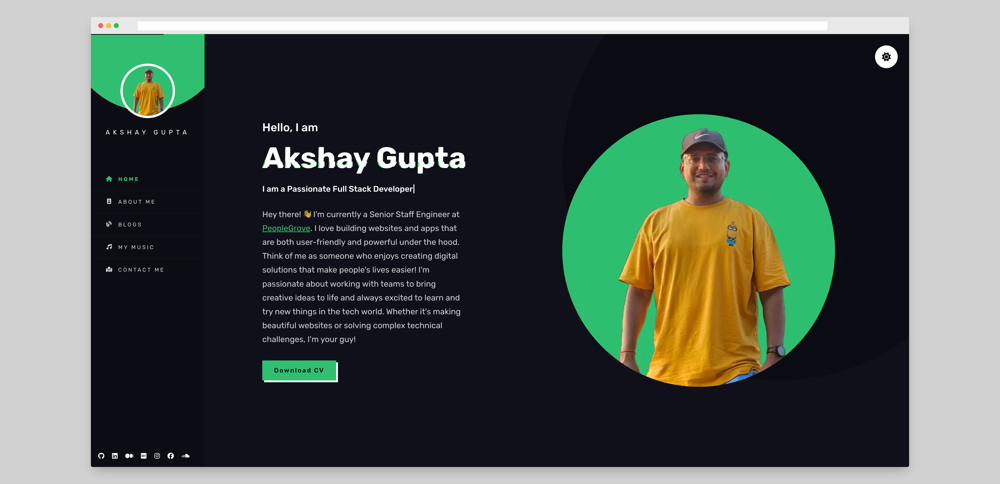

#### About Section

| 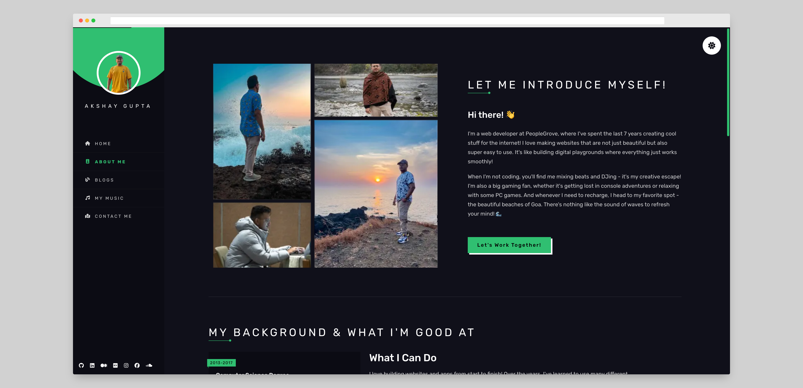 | 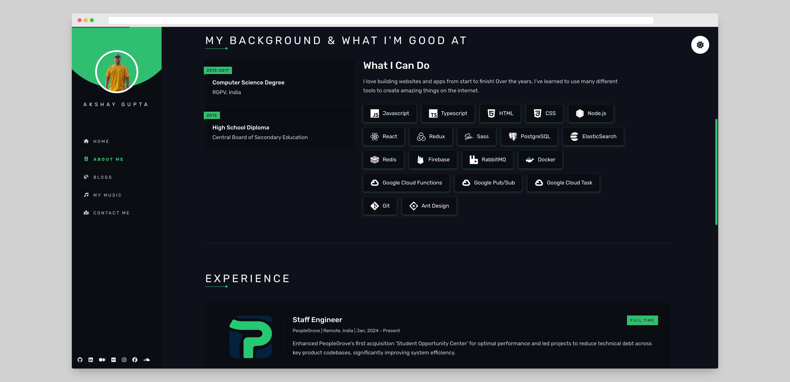 |
| :-----------------------------------------: | :-----------------------------------------: |

#### Blog Section

| 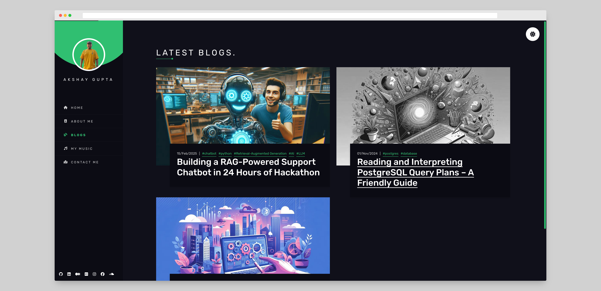 | 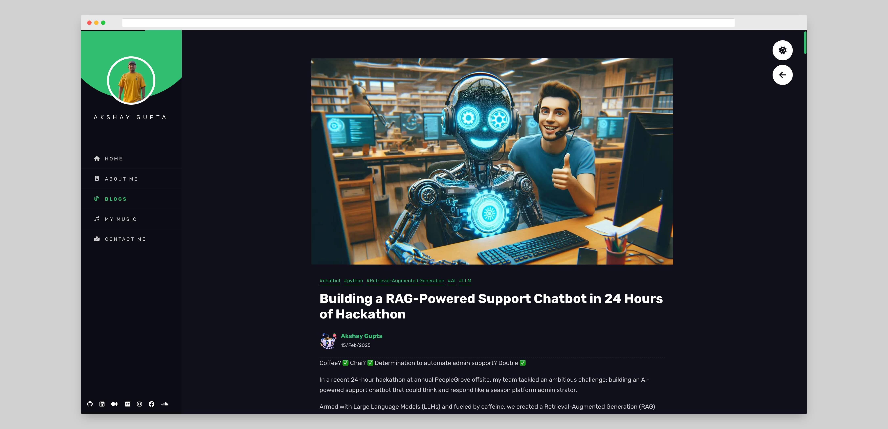 |
| :---------------------------------------: | :---------------------------------------: |

#### Music Section

| 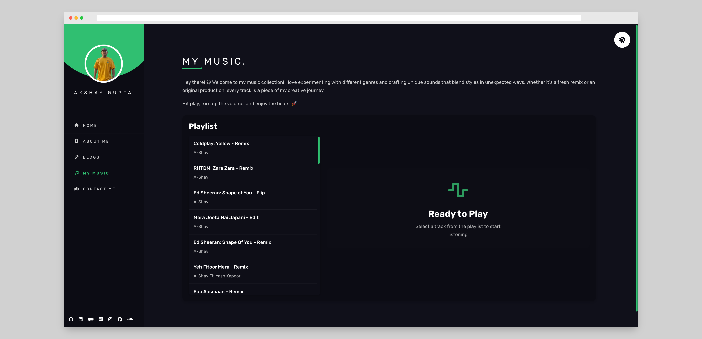 | 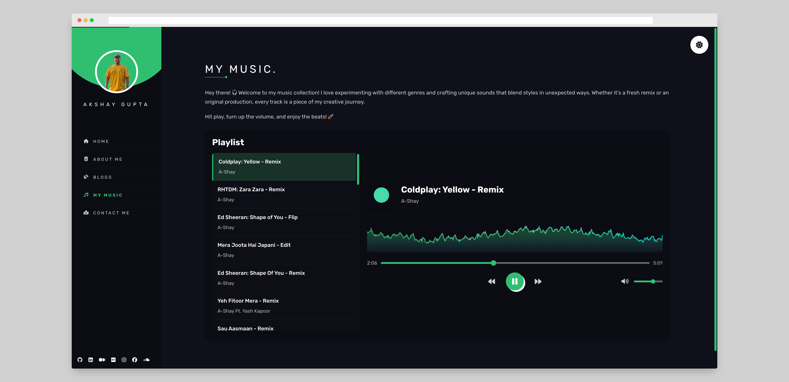 |
| :-----------------------------------------: | :-----------------------------------------: |

#### Contact Page

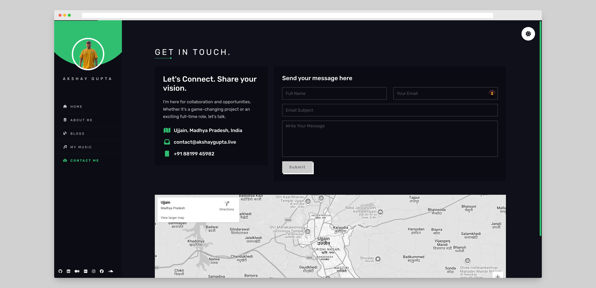

### 📱 Mobile View

|   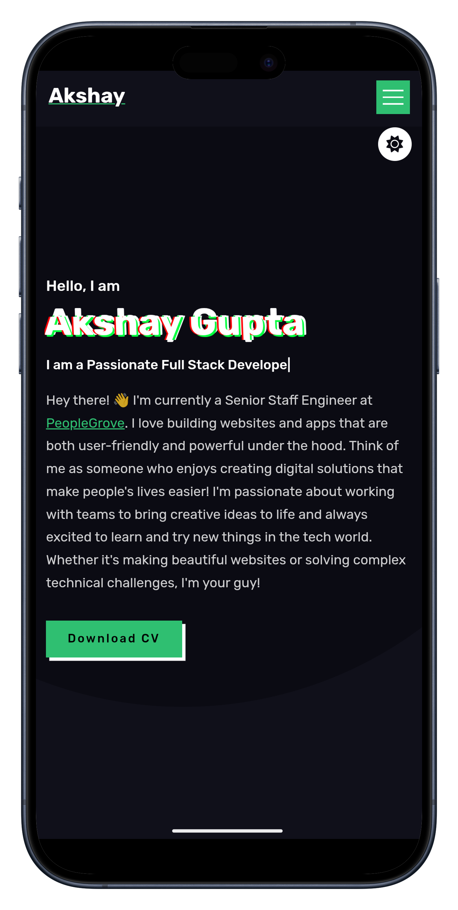   | 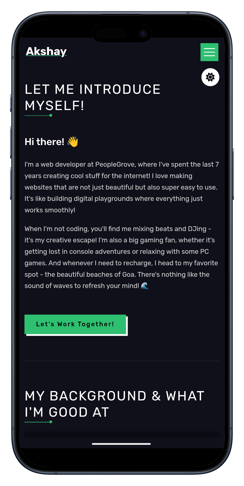 | 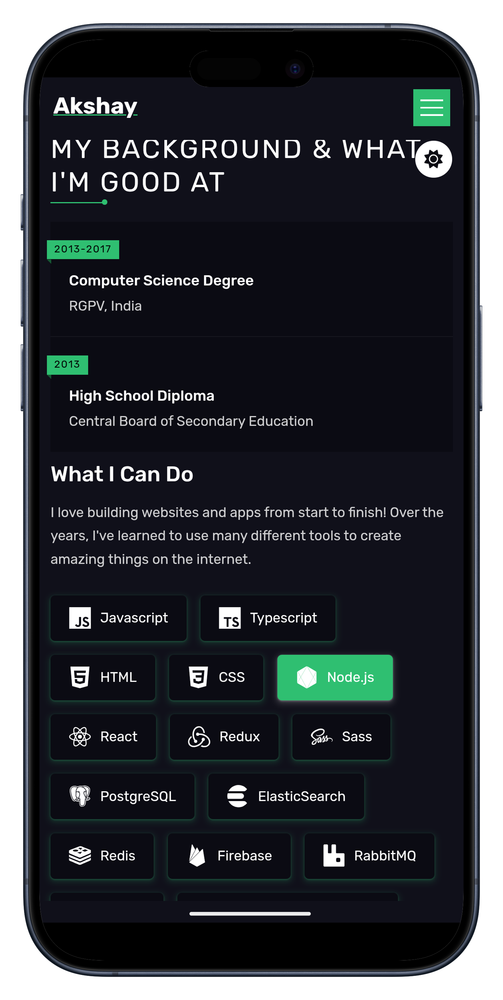 |  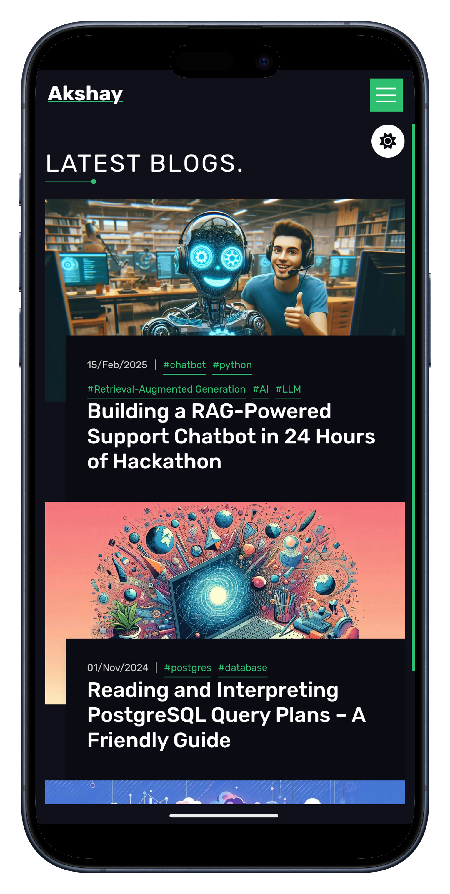  |
| :--------------------------------------: | :----------------------------------------: | :----------------------------------------: | :----------------------------------------: |
| 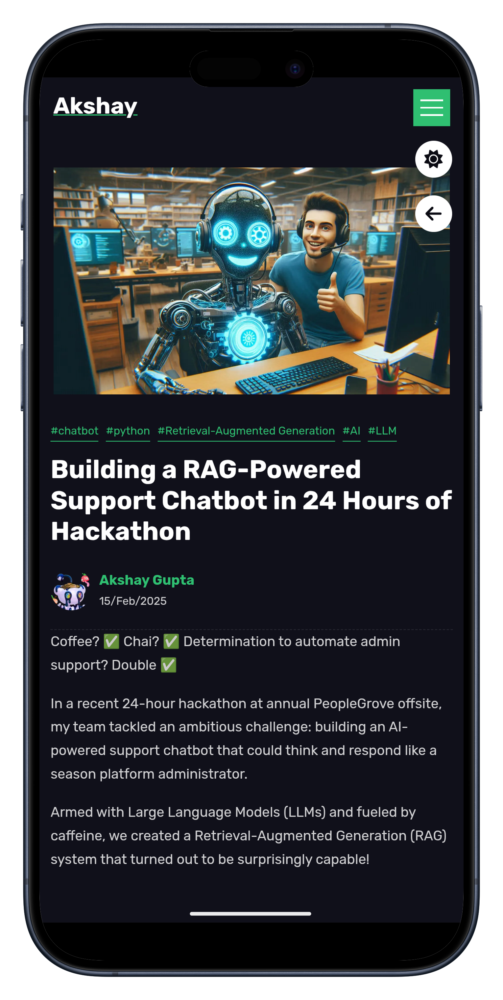 | 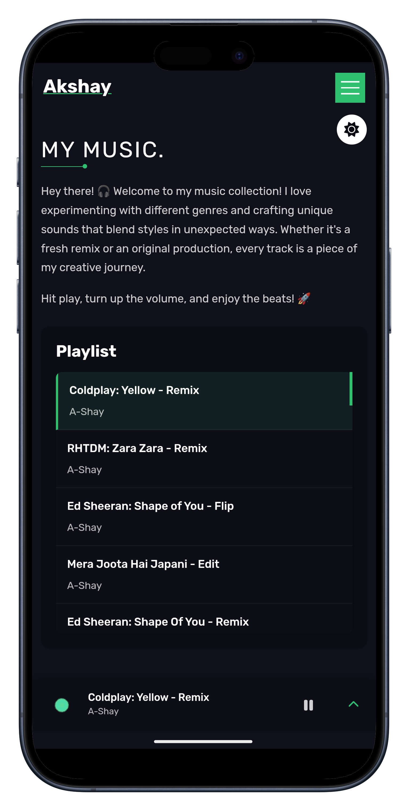 | 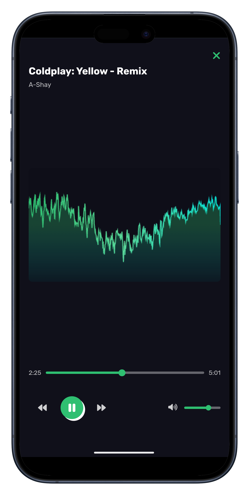 | 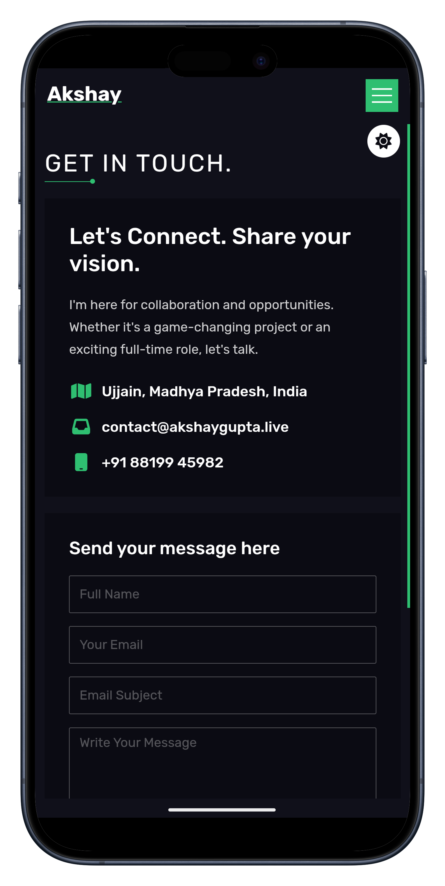 |

## 🚀 Quick Start

### 1. Environment Setup

Create `.env.local` with these magical incantations:

```env
# Email service (Required)
RESEND_API_KEY=your_key_here

# Sanity CMS (Required)
NEXT_PUBLIC_SANITY_PROJECT_ID=your_id_here
NEXT_PUBLIC_SANITY_DATASET=production
NEXT_PUBLIC_SANITY_HOOK_SECRET=your_secret_here
# Optional: defaults to 2024-09-25 if not set
NEXT_PUBLIC_SANITY_API_VERSION=2024-09-25

# Neon Database (Required for emoji reactions)
NETLIFY_DATABASE_URL=your_neon_database_url_here

# AWS S3 + CloudFront (Required for music player)
NEXT_PUBLIC_AWS_REGION=your_aws_region
NEXT_PUBLIC_AWS_ACCESS_KEY_ID=your_aws_access_key
NEXT_PUBLIC_AWS_SECRET_ACCESS_KEY=your_aws_secret_key
NEXT_PUBLIC_AWS_BUCKET_NAME=your_s3_bucket_name
NEXT_PUBLIC_CLOUDFRONT_DOMAIN=your_cloudfront_domain
NEXT_PUBLIC_CLOUDFRONT_KEY_PAIR_ID=your_cloudfront_key_pair_id
NEXT_PUBLIC_CLOUDFRONT_PRIVATE_KEY=your_cloudfront_private_key

# Analytics (Optional)
NEXT_PUBLIC_GOOGLE_ANALYTICS=your_ga_measurement_id
NEXT_PUBLIC_CLARITY_APP_CODE=your_clarity_app_code

# Rate limiting (Optional - falls back to in-memory if not set)
UPSTASH_REDIS_REST_URL=your_upstash_redis_url
UPSTASH_REDIS_REST_TOKEN=your_upstash_redis_token

# Base URL (Optional - defaults to localhost:3000)
NEXT_PUBLIC_BASE_URL=http://localhost:3000
```

### 2. Analytics Setup 📊

This project uses Google Analytics and Microsoft Clarity for basic usage analytics:

1. **Google Analytics**:

  - Create a GA4 property at [Google Analytics](https://analytics.google.com)
  - Get your Measurement ID (starts with 'G-')
  - Add it to `.env.local` as `NEXT_PUBLIC_GOOGLE_ANALYTICS`

2. **Microsoft Clarity**:
  - Create a project at [Microsoft Clarity](https://clarity.microsoft.com)
  - Get your tracking code
  - Add it to `.env.local` as `NEXT_PUBLIC_CLARITY_APP_CODE`

> Note: These analytics tools are used solely to understand usage patterns and improve user experience. No personal data is collected or processed beyond standard analytics metrics.

### 3. Rate Limiting Setup 🛡️

This project uses Upstash Redis for serverless rate limiting to prevent spam and abuse:

1. **Upstash Redis Setup**:
  - Create a free account at [Upstash](https://upstash.com)
  - Create a new Redis database
  - Copy the REST URL and REST TOKEN
  - Add them to your `.env.local` file

2. **Benefits**:
  - ✅ 10,000 requests/day free tier
  - ✅ Serverless and auto-scaling
  - ✅ Perfect for Netlify/Vercel deployments
  - ✅ Automatic failover to in-memory storage during development

3. **How it works**:
  - Contact form is limited to 5 requests per 15 minutes per IP
  - **Atomic operations** using Lua scripts to prevent race conditions
  - Redis stores request counts with automatic expiration
  - **Fixed-window rate limiting** for consistent behavior
  - Graceful degradation to in-memory storage if Redis is unavailable
  - Clear error messages for rate-limited users with retry-after headers
  - IP extraction with proper proxy support

> Note: If you don't set up Redis, the system will fall back to in-memory storage (works fine for development but won't persist across serverless function calls in production).

### 4. Database Setup 🗄️

This project uses Neon PostgreSQL for the emoji reactions feature:

1. **Neon Database Setup**:
   - Create a free account at [Neon](https://neon.tech)
   - Create a new PostgreSQL database
   - Copy the connection string
   - Add it to your `.env.local` file as `NETLIFY_DATABASE_URL`

2. **Database Migration**:
   ```bash
   # Generate migration files
   npm run db:generate
   
   # Apply migrations
   npm run db:migrate
   ```

3. **Benefits**:
   - ✅ Serverless PostgreSQL with auto-scaling
   - ✅ Perfect for Netlify/Vercel deployments
   - ✅ Type-safe operations with Drizzle ORM
   - ✅ Automatic connection pooling

> Note: The emoji reactions feature requires a database connection. Without it, the reactions won't persist.

### 5. Audio Files Setup 🎵

1. Create an S3 bucket:

  - Go to AWS Console → S3
  - Create a new bucket
  - Block all public access (for security)
  - Enable CORS for your domains

2. Set up CloudFront (Optional but recommended):

  - Create a CloudFront distribution
  - Use your S3 bucket as origin
  - Set up Origin Access Identity (OAI)
  - Create a CloudFront key pair for signed URLs
  - Configure your bucket policy to allow CloudFront access

3. Create an IAM user:
  - Create a user with programmatic access
  - Attach a policy with these permissions:

```json
{
  "Version": "2012-10-17",
  "Statement": [
    {
      "Effect": "Allow",
      "Action": ["s3:ListBucket", "s3:GetObject"],
      "Resource": [
        "arn:aws:s3:::your-bucket-name",
        "arn:aws:s3:::your-bucket-name/*"
      ]
    }
  ]
}
```

4. Configure CORS for your S3 bucket:

```json
[
  {
    "AllowedOrigins": ["http://localhost:3000", "https://your-domain.com"],
    "AllowedMethods": ["GET", "HEAD"],
    "AllowedHeaders": ["*"],
    "ExposeHeaders": ["ETag"],
    "MaxAgeSeconds": 3600
  }
]
```

### 6. Audio File Naming 🎵

Name your audio files like this:

```text
[Year][Original Artist][Name][Type][Artist].mp3
Example: [2024][The Beatles][Hey Jude][Remix][A-Shay].mp3
```

> Pro tip: The brackets are important. Very important.

### 7. Fire It Up! 🔥

```bash
npm run dev
# or
yarn dev    # For the yarn enthusiasts
# or
pnpm dev    # For the storage optimizers
# or
bun dev     # For the cool kids
```

Then visit [http://localhost:3000](http://localhost:3000) and marvel at your creation.

## 🔄 Version History

You can check out the older version built with Gatsby at [portfolio v1](https://github.com/gupta-akshay/portfolio) (Warning: Contains legacy code and nostalgia)

---

> "Why do programmers prefer dark mode? Because light attracts bugs!"

Drop me a line at [contact@akshaygupta.live](contact@akshaygupta.live) or [akshaygupta.live@gmail.com](akshaygupta.live@gmail.com) if you:

- Found a bug (it's a feature)
- Have a suggestion (I promise to read it)
- Just want to say hi (I like those too!)

Made with ❤️ and excessive amounts of caffeine by Akshay Gupta
