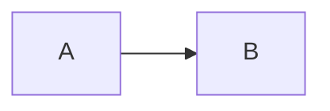

# Personal Portfolio Website V5 🚀

Live at [akshaygupta.live](https://akshaygupta.live)

Next.js App Router portfolio with MDX blogging, a custom music player, emoji
reactions, and a contact workflow — rebuilt in V5 around a neo-brutalist design
language.

## What's new in V5

- **Neo-brutalist redesign** — signal amber accent, thick ink borders, hard
  unblurred offset shadows, square corners, and instant (stepped) state changes
  in place of eased transitions. Dark-first, with the light theme carried through.
- **Fixed top navigation** replaces the former left sidebar. Below 820px it
  collapses into a dropdown with a backdrop and a genuine scroll lock.
- **Rebuilt music player** — a SoundCloud-style waveform seeker drawn from real,
  precomputed peak data, a persistent bottom player bar, and a queue drawer.
- **Precomputed waveform peaks** generated offline (see below) rather than
  decoded in the browser.
- **Blog pagination** — ten posts at a time behind a load-more control.
- **Zero icon-font runtime** — technology logos are inlined as SVG; the
  `devicon` package and eight other dependencies were removed.

## Routes

- `/` - Home
- `/about` - About, skills, experience, and GitHub contribution calendar
- `/resume` - Print-ready resume with full CV content (summary, skills, experience, education)
- `/blog` - Paginated blog index from MDX content
- `/blog/[slug]` - Individual blog post pages
- `/feed.xml` - RSS feed of all published blog posts
- `/music` - Music showcase with custom player
- `/contact` - Contact form + map section

Public content routes support HTTP content negotiation for agents. Send
`Accept: text/markdown` to the canonical URL to receive a source-backed Markdown
representation while regular browser requests continue to receive HTML:

```bash
curl -H 'Accept: text/markdown' https://akshaygupta.live/blog
```

Because production is proxied through Cloudflare, add a Cache Rule for
`akshaygupta.live` that bypasses cache when any `Accept` header value contains
`text/markdown`. If a negotiated request is still blocked, inspect the matching
Security Event and narrowly exempt only GET/HEAD Markdown requests from the
specific WAF or bot rule that produced the 403; do not disable bot protection
for the zone.

## Tech Stack

- Next.js 16 + React 19 + TypeScript
- Sass modules + global Sass architecture
- Space Grotesk (display/body) + Space Mono (metadata, numerals) via `next/font`
- MDX (`@next/mdx`, `remark-gfm`, `rehype-slug`, `rehype-prism-plus`); Mermaid is
  rendered on the client
- TanStack Form + Zod for contact validation
- Drizzle ORM + Neon/PostgreSQL (emoji reactions)
- AWS S3 + CloudFront signing for music delivery
- Resend for email sending
- Sentry + Vercel Analytics + Vercel Speed Insights
- Google Analytics + Microsoft Clarity
- Inline SVG icons via a local `Icon` component (no icon font, no icon runtime)

## Design System

Tokens live in `src/app/styles/variables.scss`.

| Token                       | Value                    | Role                                  |
| --------------------------- | ------------------------ | ------------------------------------- |
| `$px-theme`                 | `#fbbf24`                | Signal amber — primary accent         |
| `$px-theme-ink`             | `#7a5c0d`                | Accent **as text on light backgrounds** |
| `$px-violet`                | `#8b5cf6`                | Secondary pop (remix badges, toggles) |
| `$px-ink` / `$px-ink-light` | `#ffffff` / `#0b0b10`    | Borders and headings per theme        |
| `$bd-thick` / `$bd-thin`    | `3px` / `2px`            | Border weights                        |
| `$shadow-sm/md/lg`          | `4/6/10px` hard offset   | Unblurred offset shadows              |

Two conventions matter when adding UI:

- **Shadows use `var(--shadow-ink)`**, a custom property that resolves to white
  on the dark theme and black on the light one. A hard black shadow is invisible
  on a near-black canvas, so never hardcode the offset colour.
- **Amber fails contrast as text on light backgrounds** (~1.6:1). Use
  `$px-theme-ink` for accent-coloured text inside `body.theme-light`; keep the
  brighter `$px-theme` for fills, borders and dark-mode text.

## Current Features

- Theme toggle (dark/light) with FOUC-free inline theme bootstrapping
- Per-route error boundaries powered by a shared `RouteError` component (captures to Sentry in prod)
- Typed env schema (`src/env.ts`) validated with Zod; boot fails fast on missing required keys
- In-memory rate limiting on `/api/reactions` (30/min) and `/api/sendMail` (5/hour); returns 429 + `Retry-After`
- SEO metadata and OpenGraph image routes; canonical URLs use `getSiteUrl()` (`src/lib/site-url.ts`). Set `NEXT_PUBLIC_SITE_URL` in production to match your Vercel primary domain so Open Graph, canonical links, RSS, sitemap, and JSON-LD stay aligned
- MDX blog pipeline with:
  - table of contents (server-extracted headings, no DOM polling)
  - reading progress bar
  - reading time
  - social sharing (custom component; no third-party share SDK)
  - emoji reactions backed by PostgreSQL
  - RSS feed at `/feed.xml`
  - draft support (`draft: true` hides posts in production)
  - pagination on the index — ten posts per page
  - body copy width matched to the feature image
  - mermaid diagrams rendered on the client by `MermaidRenderer`, theme-aware
- Music page with:
  - waveform seeker driven by precomputed peaks (click to seek, drag to scrub,
    hover for a time tooltip, keyboard-accessible via a hidden range input)
  - persistent bottom player bar and slide-in queue drawer
  - S3/CloudFront signed URLs (server-side signing only)
  - playback state persisted across page loads (track, volume)
  - keyboard shortcuts: Space (play/pause), M (mute), ←/→ (prev/next), ↑/↓ (volume)
  - previous restarts the current track when more than 3s in
- Resume page (`/resume`) with:
  - single 880px document column
  - bullet-point experience sourced from CV data
  - `@media print` styles: hides nav/controls, forces readable colors, avoids page breaks inside atomic blocks
  - Download Resume PDF action
- Contact page with:
  - validated form submission
  - email API route (`/api/sendMail`)
  - rate-limited UX feedback

## Music Waveforms

Peaks are generated offline and committed, not computed in the browser:

```bash
pnpm peaks:generate
```

The script lists the S3 bucket, downloads each track, decodes it with **ffmpeg**,
and writes 400 peak buckets (quantized to one byte each) plus the exact duration
to `src/app/data/track-peaks.json` — roughly 540 bytes per track.

Deriving peaks client-side would mean downloading every MP3 a second time (the
`<audio>` element streams its own copy) and the waveform could not appear until
the full file landed; Vercel's serverless runtime has no audio decoder. Durations
travel with the track listing so every row shows one, while peaks are returned
per-track by `/api/music/url`, which the player already calls on selection.

Re-run the script whenever tracks are added or replaced. It requires `ffmpeg` on
PATH and AWS credentials. A track missing from the JSON falls back to a flat
placeholder strip, so a stale file degrades rather than breaks.

## Project Structure

```text
src/app/                  # App Router pages, layouts, API routes, styles
src/app/components/Icon/  # Inline SVG icon system (icons.ts + techIcons.ts)
src/app/data/             # Generated track-peaks.json
src/lib/mdx/              # MDX loaders, parsing helpers, types
content/blog/             # Blog posts (.mdx)
db/                       # Drizzle schema + db client
migrations/               # SQL migrations generated by Drizzle
scripts/                  # Offline tooling (peaks generation, image conversion)
public/                   # Static assets
```

## Environment Variables

Create `.env.local` in project root. A committed `.env.example` mirrors the keys below.

```env
# Required for contact form emails
RESEND_API_KEY=

# Required for emoji reactions API and Drizzle scripts
DATABASE_URL=

# Required for music storage/signing (server-only — do NOT prefix with NEXT_PUBLIC_)
AWS_REGION=
AWS_ACCESS_KEY_ID=
AWS_SECRET_ACCESS_KEY=
AWS_BUCKET_NAME=
CLOUDFRONT_DOMAIN=
CLOUDFRONT_KEY_PAIR_ID=
CLOUDFRONT_PRIVATE_KEY=

# Optional: canonical public URL (no trailing slash); match Vercel primary domain
NEXT_PUBLIC_SITE_URL=

# Optional analytics
NEXT_PUBLIC_GOOGLE_ANALYTICS=
NEXT_PUBLIC_CLARITY_APP_CODE=

# Optional Sentry source-map upload in CI
SENTRY_AUTH_TOKEN=

# Optional: skip server env validation (for Docker build stages)
# SKIP_ENV_VALIDATION=true
```

## Local Development

Requires Node v24 (`.nvmrc`) and pnpm. `pnpm peaks:generate` additionally needs
`ffmpeg`.

```bash
pnpm install
pnpm db:migrate
pnpm dev
```

Open [http://localhost:3000](http://localhost:3000).

## Scripts

| Command                   | Description                                  |
| ------------------------- | -------------------------------------------- |
| `pnpm dev`                | Start Next.js dev server                     |
| `pnpm build`              | Production build                             |
| `pnpm start`              | Run production server                        |
| `pnpm lint`               | Run ESLint                                   |
| `pnpm peaks:generate`     | Regenerate music waveform peaks from S3       |
| `pnpm images:to-webp`     | Convert images in `public/` to WebP           |
| `pnpm db:generate`        | Generate Drizzle migrations                  |
| `pnpm db:migrate`         | Apply migrations                             |
| `pnpm db:studio`          | Open Drizzle Studio                          |
| `ANALYZE=true pnpm build` | Build with bundle analyzer                   |

## Blog Authoring (MDX)

Posts live in `content/blog/*.mdx`. Each post should export metadata:

```mdx
export const metadata = {
  title: 'Your Blog Title',
  slug: 'your-blog-slug',
  publishedAt: '2025-01-15', // YYYY-MM-DD
  modifiedAt: '2025-02-01', // optional; only for substantive updates
  categories: ['category1', 'category2'],
  coverImage: '/images/blog/your-cover.webp',
  coverImageAlt: 'Description of cover image',
  author: {
    name: 'Akshay Gupta',
    avatar: '/images/blog-author.webp',
  },
  excerpt: 'A short description of your blog post.',
  draft: true, // optional — omit or set false to publish
};
```

Metadata is validated at build time via Zod (`src/lib/mdx/schema.ts`). A missing required field, a filename/`slug` mismatch, an invalid date format, or a `modifiedAt` earlier than `publishedAt` will log an error and exclude the post from the listing. Posts with `draft: true` are visible in development but hidden in production builds.

### Mermaid diagrams

Fence a code block with `mermaid`:

````md

```mermaid
flowchart LR
  A --> B
```
````

MDX builds stay fast and hermetic — no Playwright/Chromium on the build server.
The `MermaidRenderer` client component loads `mermaid` on demand on blog pages
and re-renders when the theme changes.

## Observability & Security

- Sentry configured for Next.js (server, client, edge)
- Vercel Analytics + Speed Insights
- Optional GA + Clarity integration
- Strict headers/CSP configured in `next.config.mjs`

## Contact

- Email: [contact@akshaygupta.live](mailto:contact@akshaygupta.live)
- Alternate: [akshaygupta.live@gmail.com](mailto:akshaygupta.live@gmail.com)
- Site: [akshaygupta.live](https://akshaygupta.live)
