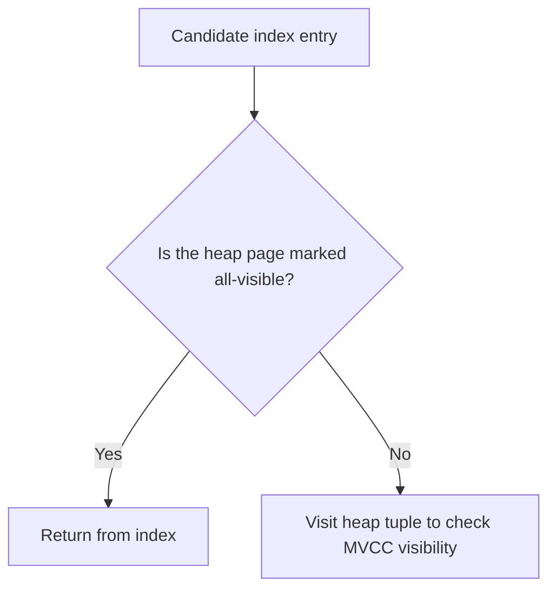

export const metadata = {
    title: 'Why PostgreSQL Index-Only Scans Still Hit the Heap',
    slug: 'postgresql-index-only-scans-visibility-map-heap-fetches',
    publishedAt: '2026-07-18',
    categories: ['postgres', 'database', 'performance'],
    coverImage: '/images/blog/postgresql-index-only-scans-visibility-map-heap-fetches.webp',
    coverImageAlt: 'PostgreSQL index pages connected to a visibility map while selected pages still require heap access',
    author: {
        name: 'Akshay Gupta',
        avatar: '/images/blog-author.webp'
    },
    excerpt: 'A covering index can produce an Index Only Scan and still visit the heap. Learn how PostgreSQL visibility maps, VACUUM, and write activity control Heap Fetches.'
}

In the previous posts in this PostgreSQL performance series, we covered [query tuning](/blog/postgresql-query-performance-tuning-tips), learned how to [read query plans](/blog/reading-and-interpreting-postgresql-query-plans-a-friendly-guide), and walked through [PostgreSQL index types and covering indexes](/blog/postgresql-indexing-deep-dive-choosing-the-right-index).

There is one important detail hiding behind all three topics.

You can build the right covering index, get an `Index Only Scan`, and still see PostgreSQL visit the table thousand of times.

The clue is this line:

```text
Heap Fetches: ...
```

An index-only scan describes what the plan *can* return from the index. It does not guarantee that the executor will avoid every heap page. Whether PostgreSQL can skip those heap visits depends heavily on the table's **visibility map**.

This article explains that connection and gives you a practical way to diagnose it.

> This article was verified against the PostgreSQL 18 documentation, the current stable documentation in July, 2026. Check the matching documentation for your deployed major version before changing any production settings.

## What an Index-Only Scan Actually Promises

PostgreSQL needs two things before it can chose an index-only scan:

1. The index must support index-only scans.
2. Every column required by the query must be available from the index.

B-tree indexes always support index-only scans. GiST and SP-GiSt support them for some operator classes, while GIN does not because its entries generally cannot reconstruct the complete original value. [PostgreSQL documentation: Index-Only Scans and Covering Indexes](https://www.postgresql.org/docs/18/indexes-index-only-scans.html)

Consider this query:

```sql
SELECT customer_id, total_amount, status
FROM orders
WHERE customer_id = 12345;
```

A covering index can provide every referenced column:

```sql
CREATE INDEX idx_orders_customer_covering
ON orders (customer_id)
INCLUDE (total_amount, status);
```

`customer_id` is the search key. `total_amount` and `status` are payload columns stored in the index. They do not participate in the B-tree search or change the uniqueness semantics of a unique index. [PostgreSQL documentation: `INCLUDE` payload columns](https://www.postgresql.org/docs/18/indexes-index-only-scans.html)

That makes an index-only scan *possible*. PostgreSQL still has another question to answer:

> Is this row version visible to the current transaction?

## Why Visibility Forces Heap Access

PostgreSQL uses Multi-Version Concurrency Control (MVCC). Different transactions can legitimately see different row versions. Index entries do not store enough visibility information to answer that question on their own. The visibility information lives with the tuple in the heap. [PostgreSQL documentation: Concurrency Control](https://www.postgresql.org/docs/18/mvcc.html)

Fetching every matching heap tuple would defeat much of the benefit of an index-only scan, so PostgreSQL maintains a compact structure called the **visibility map**.

Each heap page has two visibility-map bits:

- **All-visible** means every tuple on that page is visible to all current and future transactions.
- **All-frozen** means every tuple on that page has also been frozen, so a future vacuum does not need to revisit the page until it changes.

The map is conservative. `VACUUM` sets visibility bits only when it can prove the condition is true. A data-modifying operation clears the relevant bit when it changes a page. [PostgreSQL documentation: Visibility Map](https://www.postgresql.org/docs/18/storage-vm.html)

During an index-only scan, PostgreSQL follows this decision:



The visibility map is much smaller than the heap it describes, so it is far more likely to remain cached. When the all-visible bit is set, PostgreSQL can avoid the heap access. When it is clear, PostgreSQL must inspect the heap tuple even if every selected column already exists in the index. [PostgreSQL documentation: How index-only scans use the visibility map](https://www.postgresql.org/docs/18/indexes-index-only-scans.html)

That is why the plan can say `Index Only Scan` while `Heap Fetches` remain greater than zero.

## A Reproducible Diagnostic Workflow

Start with the query plan, then work outward. Do not tune autovacuum from a single metric in isolation.

### Step 1: Confirm the Plan and Read `Heap Fetches`

Use `EXPLAIN` with runtime and buffer information:

```
EXPLAIN (ANALYZE, BUFFERS)
SELECT customer_id, total_amount, status
FROM orders
WHERE customer_id = 12345;
```

Look for:

```text
Index Only Scan using idx_orders_customer_covering on orders
  Index Cond: (customer_id = 12345)
  Heap Fetches: <count>
```

Interpret the output carefully:

- `Index Only Scan` confirms that the index contains the columns required by the query.
- `Heap Fetches: 0` means all matching tuples were on pages PostgreSQL could trust as all-visible during this execution.
- A nonzero count means PostgreSQL had to visit heap tuples for visibility checks.

Run the query under representative load and parameters. One fast execution against a warm cache does not prove that the index is healthy for the full workload.

### Step 2: Check Table Maintenance and Write Activity

`pg_stat_user_tables` exposes estimated live and dead tuple counts, insert activity since the last vacuum, and timestamps and counts for manual and automatic vacuum runs. [PostgreSQL documentation: `pg_stat_all_tables`](https://www.postgresql.org/docs/18/monitoring-stats.html#MONITORING-PG-STAT-ALL-TABLES-VIEW)

```sql
SELECT
  schemaname,
  relname,
  n_live_tup,
  n_dead_tup,
  n_tup_ins,
  n_tup_upd,
  n_tup_del,
  n_ins_since_vacuum,
  last_vacuum,
  last_autovacuum,
  vacuum_count,
  autovacuum_count
FROM pg_stat_user_tables
WHERE relname = 'orders';
```

This view gives you signals, not a verdict. Its tuple counts are estimates, and cumulative counters can span a long period. Use them to answer practical questions:

- Is the table receiving frequent updates or deletes?
- Has autovacuum run recently?
- Are inserts accumulating between vacuum runs?
- Does a high-heap-fetch period line up with write bursts?

A write-heavy table can continuously clear all-visible bits. In that case, a covering index may still reduce the amount of data PostgreSQL reads, but a truly heap-free scan may be an unrealistic steady-state goal.

### Step 3: Inspect the Visibility Map Directly

For deeper diagnosis, PostgreSQL ships the `pg_visibility` extension. It can report the number of all-visible and all-frozen pages recorded in a relation's visibility map. Access is restricted to superusers and roles with the documented statistics privileges. [PostgreSQL documentation: `pg_visibility`](https://www.postgresql.org/docs/18/pgvisibility.html)

```sql
CREATE EXTENSION IF NOT EXISTS pg_visibility;

SELECT *
FROM pg_visibility_map_summary('public.orders'::regclass);
```

To calculate the share of heap pages currently marked all-visible:

```sql
WITH vm AS (
  SELECT all_visible
  FROM pg_visibility_map_summary('public.orders'::regclass)
), heap AS (
  SELECT relpages::bigint AS total_pages
  FROM pg_class
  WHERE oid = 'public.orders'::regclass
)
SELECT
  vm.all_visible,
  heap.total_pages,
  ROUND(
    100.0 * vm.all_visible / NULLIF(heap.total_pages, 0),
    2
  ) AS all_visible_percent
FROM vm
CROSS JOIN heap;
```

`pg_class.relpages` is a planner estimate updated by `VACUUM`, `ANALYZE`, and some DDL commands, so treat the percentage as diagnostic rather than exact. [PostgreSQL documentation: `pg_class`](https://www.postgresql.org/docs/18/catalog-pg-class.html)

If the all-visible percentage is low and heap fetches are high, the visibility map is a strong lead. If it is high but the query still performs poorly, continue investigating selectivity, buffer reads, index size, cache behavior, and the number of rows returned.

## Use Manual `VACUUM` as a Test, Not the Permanent Fix

A controlled manual vacuum can help confirm the diagnosis:

```sql
VACUUM (VERBOSE) orders;
```

Then rerun the same `EXPLAIN (ANALYZE, BUFFERS)` and compare:

- `Heap Fetches`
- heap blocks read and hit
- total execution time across several representative executions

Routine `VACUUM` maintains the visibility map. It also removes dead row versions that are no longer needed and makes their space reusable. PostgreSQL can run ordinary `VACUUM` alongside normal reads and writes, although it still creates I/O and CPU load. `VACUUM FULL` is a different operation that rewrites the table and takes a much stronger lock, so it is not the routine solution for visibility-map coverage. [PostgreSQL documentation: Routine Vacuuming](https://www.postgresql.org/docs/18/routine-vacuuming.html) and [PostgreSQL documentation: `VACUUM`](https://www.postgresql.org/docs/18/sql-vacuum.html)

If heap fetches fall after `VACUUM` and rise again as writes continue, you have learned something useful: the index is capable of serving the query, but the maintenance cadence and workload keep invalidating page visibility.

Running manual `VACUUM` forever is usually the wrong operational answer. The next step is to understand why autovacuum is not keeping pace.

## Tune Autovacuum Per Table, Based on Evidence

Autovacuum decides when to vacuum using a base threshold plus a scale factor tied to table size. In PostgreSQL 18, the defaults for update/delete-triggered vacuuming are `autovacuum_vacuum_threshold = 50` and `autovacuum_vacuum_scale_factor = 0.2`. These settings can be overridden per table. [PostgreSQL 18 documentation: Automatic Vacuuming](https://www.postgresql.org/docs/18/runtime-config-vacuum.html#RUNTIME-CONFIG-AUTOVACUUM)

For a large table, a percentage-based threshold can still represent many changed rows. If measurements show that vacuum consistently starts too late, lower the table-specific scale factor instead of immediately changing the cluster-wide default:

```sql
ALTER TABLE orders SET (
  autovacuum_vacuum_scale_factor = 0.02,
  autovacuum_vacuum_threshold = 1000
);
```

Those values are examples, not universal recommendations. A lower threshold causes more frequent vacuum work. Measure the effect on query latency, I/O, CPU, dead tuples, and autovacuum duration before and after the change.

You can inspect the effective table options with:

```sql
SELECT relname, reloptions
FROM pg_class
WHERE oid = 'public.orders'::regclass;
```

When a vacuum is running, `pg_stat_progress_vacuum` reports its current phase and block progress for manual vacuum and autovacuum workers. [PostgreSQL documentation: Vacuum Progress Reporting](https://www.postgresql.org/docs/18/progress-reporting.html#VACUUM-PROGRESS-REPORTING)

```sql
SELECT
  pid,
  relid::regclass AS table_name,
  phase,
  heap_blks_total,
  heap_blks_scanned,
  heap_blks_vacuumed,
  index_vacuum_count
FROM pg_stat_progress_vacuum;
```

If vacuum runs frequently but still falls behind, the trigger may not be the only issue. Check whether workers are saturated across many tables, whether cost-based delays are too restrictive for the workload, and whether long-running transactions prevent dead tuples from becoming removable.

## Common Misdiagnoses

### "The Planner Chose `Index Only Scan`, So the Heap Is Never Read"

The node name describes the data source available to the executor. MVCC visibility can still require heap visits. Read `Heap Fetches` before declaring success.

### "Adding More `INCLUDE` Columns Will Remove Heap Fetches"

`INCLUDE` solves column coverage. It does not solve visibility. Adding payload columns also duplicates data in the index, increases its size, and can slow searches or fail if an index tuple exceeds the index type's size limit. [PostgreSQL documentation: Covering-index cautions](https://www.postgresql.org/docs/18/indexes-index-only-scans.html)

### "`ANALYZE` Updates the Visibility Map"

`ANALYZE` collects planner statistics. `VACUUM` maintains the visibility map. `VACUUM (ANALYZE)` performs both operations, but it is the vacuum work that changes visibility-map coverage. [PostgreSQL documentation: Routine Vacuuming](https://www.postgresql.org/docs/18/routine-vacuuming.html)

### "High Heap Fetches Always Mean Autovacuum Is Broken"

Freshly modified pages are expected to lose their all-visible status. On a hot table, write activity can clear bits faster than vacuum can set them again. The right conclusion may be that index-only scans are only partially beneficial for this workload.

### "Zero Heap Fetches Means the Query Is Fast"

It means the scan avoided heap visibility checks for that execution. The query can still read a large index range, return too many rows, perform expensive work above the scan node, or compete for I/O and CPU.

## A Practical Checklist

When a covering index does not deliver the result you expected:

1. Run `EXPLAIN (ANALYZE, BUFFERS)` with representative parameters.
2. Confirm that the plan uses `Index Only Scan`.
3. Record `Heap Fetches`, returned rows, buffer reads, and execution time.
4. Check `pg_stat_user_tables` for write activity and recent vacuum history.
5. Inspect all-visible coverage with `pg_visibility` when privileges allow it.
6. Use a controlled manual `VACUUM` to test the visibility-map hypothesis.
7. If the evidence supports it, tune autovacuum for that table and monitor the trade-off.
8. Reconsider the covering index if the table changes too often for index-only scans to avoid meaningful heap work.

## Wrapping Up

A covering index is only half of an index-only scan.

The index must contain the required columns, but PostgreSQL must also prove that each matching tuple is visible to the query. The visibility map lets it make that decision without reading the heap. Write activity clears the map's all-visible bits, and `VACUUM` restores them when it is safe.

So when `Heap Fetches` starts climbing, do not immediately add another index. Read the plan, inspect maintenance history, measure visibility-map coverage, and tune vacuum only when the evidence points there.

That is the difference between creating a covering index and operating one successfully.

## Sources

- [PostgreSQL 18: Index-Only Scans and Covering Indexes](https://www.postgresql.org/docs/18/indexes-index-only-scans.html)
- [PostgreSQL 18: Visibility Map](https://www.postgresql.org/docs/18/storage-vm.html)
- [PostgreSQL 18: Routine Vacuuming](https://www.postgresql.org/docs/18/routine-vacuuming.html)
- [PostgreSQL 18: Automatic Vacuuming Configuration](https://www.postgresql.org/docs/18/runtime-config-vacuum.html)
- [PostgreSQL 18: `pg_visibility`](https://www.postgresql.org/docs/18/pgvisibility.html)
- [PostgreSQL 18: Cumulative Statistics Views](https://www.postgresql.org/docs/18/monitoring-stats.html)
- [PostgreSQL 18: Vacuum Progress Reporting](https://www.postgresql.org/docs/18/progress-reporting.html#VACUUM-PROGRESS-REPORTING)
