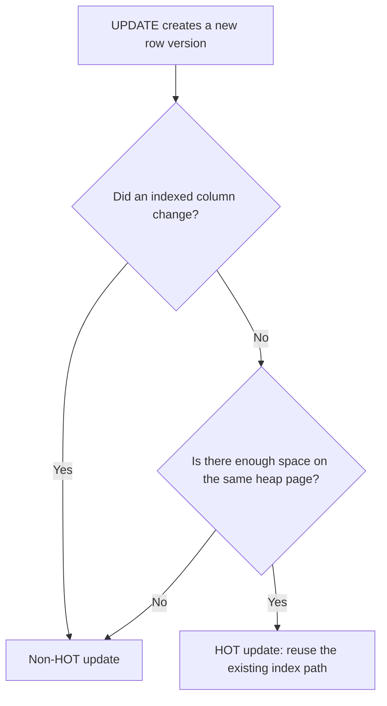

export const metadata = {
    title: 'PostgreSQL HOT Updates: When UPDATE Avoids Touching Indexes',
    slug: 'postgresql-hot-updates-fillfactor-index-write-amplification',
    publishedAt: '2026-07-20',
    categories: ['postgres', 'database', 'performance'],
    coverImage: '/images/blog/postgresql-hot-updates-fillfactor-index-write-amplification.webp',
    coverImageAlt: 'A PostgreSQL heap page moving an updated row into nearby free space while the index remains unchanged',
    author: {
        name: 'Akshay Gupta',
        avatar: '/images/blog-author.webp'
    },
    excerpt: 'PostgreSQL can sometimes update a row without creating new index entries. Learn how HOT updates work, why fillfactor matters, and how to measure the result safely.'
}

## Introduction

In the last article, we saw why an [index-only scan can still fetch from the heap](/blog/postgres-index-only-scans-visibility-map-heap-fetches). This time, let us follow the write path in the opposite direction.

An `UPDATE` in PostgreSQL does not overwrite a row in place. Under MVCC, it creates a new row version. That new version may also require fresh entries in every relevant index, even when the application appears to be changing one small field. PostgreSQL has an optimization for avoiding part of that work: **heap-only tuples**, usually called **HOT updates**. [PostgreSQL 18 documentation: Heap-Only Tuples](https://www.postgresql.org/docs/18/storage-hot.html)

HOT is useful, but it is not a switch you turn on. It is an outcome that becomes possible when the update and the physical page layout meet two conditions. This article explains those conditions, shows how to measure HOT updates, and gives you a careful way to decide whether `fillfactor` or index design deserves attention.

> This article was verified against PostgreSQL 18, the current stable documentation on July 20, 2026. PostgreSQL 19 was still a development version on that date. Check the documentation for your deployed major version before applying changes.

## Why an UPDATE Can Become Index Work

PostgreSQL uses multiversion concurrency control so concurrent transactions can see the row versions appropriate to their snapshots. An update therefore adds a new row version to the heap instead of replacing the existing version in place. Without HOT, the new version can also need new index entries, and obsolete row versions and index entries eventually need cleanup. [PostgreSQL 18 documentation: Heap-Only Tuples](https://www.postgresql.org/docs/18/storage-hot.html)

Consider a table that separates frequently changing state from stable lookup columns:

```sql
CREATE TABLE jobs (
  id bigint GENERATED ALWAYS AS IDENTITY PRIMARY KEY,
  queue_name text NOT NULL,
  status text NOT NULL,
  attempts integer NOT NULL DEFAULT 0,
  locked_at timestamptz,
  payload jsonb NOT NULL
) WITH (fillfactor = 80);

CREATE INDEX jobs_queue_status_idx
ON jobs (queue_name, status);
```

The `attempts` and `locked_at` columns are not referenced by either index. An update that changes only those columns may qualify for HOT:

```sql
UPDATE jobs
SET attempts = attempts + 1,
    locked_at = clock_timestamp()
WHERE id = 42;
```

Changing `status`, however, changes a column referenced by `jobs_queue_status_idx`, so that update cannot use HOT for this table:

```sql
UPDATE jobs
SET status = 'running'
WHERE id = 42;
```

The important word is *may*. Avoiding indexed columns is necessary, but it is not sufficient.

## The Two Conditions for HOT

PostgreSQL 18 documents two requirements for a HOT update:

1. The update must not modify a column referenced by a table index, excluding summarizing indexes. BRIN is the only summarizing index method included in core PostgreSQL.
2. The heap page containing the old row must have enough free space for the new row version.

When both conditions hold, PostgreSQL does not need new entries in ordinary indexes for the updated row. Summarizing indexes may still need an update. PostgreSQL can also remove intermediate versions in a HOT chain during normal operation, including `SELECT`, when those versions are no longer visible to anyone. [PostgreSQL 18 documentation: Heap-Only Tuples](https://www.postgresql.org/docs/18/storage-hot.html)

The same-page rule explains why HOT is partly a physical-layout concern. Even an update to a completely unindexed column becomes non-HOT when the new tuple has to move to another heap page.



This is also why adding an index can have a write-side consequence that a read-only review misses. If the new index references a frequently updated column, those updates stop being HOT-eligible. Payload columns added with `INCLUDE` are still referenced by the index, so changing one also fails the first HOT condition. That follows directly from PostgreSQL's rule that no column referenced by an index may be modified. [PostgreSQL 18 documentation: Heap-Only Tuples](https://www.postgresql.org/docs/18/storage-hot.html) and [PostgreSQL 18 documentation: Index-Only Scans and Covering Indexes](https://www.postgresql.org/docs/18/indexes-index-only-scans.html)

Expression indexes deserve the same review. PostgreSQL stores the result of the expression in the index and recomputes it for inserts and non-HOT updates. If an update changes a column on which an indexed expression depends, it is not HOT-eligible. [PostgreSQL 18 documentation: Indexes on Expressions](https://www.postgresql.org/docs/18/indexes-expressional.html)

## What fillfactor Actually Changes

For a table, `fillfactor` is a percentage from 10 through 100, and the default is 100. With a lower value, PostgreSQL packs pages only to that percentage during inserts and reserves the remaining space for updated row versions on the same page. This makes HOT updates more likely. The trade-off is lower initial row density, so the table can occupy more pages. [PostgreSQL 18 documentation: CREATE TABLE storage parameters](https://www.postgresql.org/docs/18/sql-createtable.html#SQL-CREATETABLE-STORAGE-PARAMETERS)

You can set it when creating a table:

```sql
CREATE TABLE account_balances (
  account_id bigint PRIMARY KEY,
  balance numeric(18, 2) NOT NULL,
  updated_at timestamptz NOT NULL
) WITH (fillfactor = 80);
```

Or change the storage parameter for future writes:

```sql
ALTER TABLE account_balances SET (fillfactor = 80);
```

`80` is an example, not a universal target. A table that is rarely updated may benefit more from the default complete packing. A heavily updated table may benefit from reserved page space, but the right value depends on tuple width, update frequency, access patterns, and storage budget. PostgreSQL's documentation explicitly recommends complete packing for never-updated tables and says smaller values can be appropriate for heavily updated tables. [PostgreSQL 18 documentation: `fillfactor`](https://www.postgresql.org/docs/18/sql-createtable.html#SQL-CREATETABLE-STORAGE-PARAMETERS)

Do not lower `fillfactor` just because a table receives updates. First establish whether HOT eligibility is low, whether updates are actually important to the workload, and whether same-page space is the limiting condition.

## Measure HOT Instead of Guessing

`pg_stat_user_tables` exposes three useful cumulative counters:

- `n_tup_upd`: total updated rows, including HOT updates and updates whose successor landed on a new page.
- `n_tup_hot_upd`: updated rows whose successor needed no new index entries.
- `n_tup_newpage_upd`: updated rows whose successor landed on a different heap page. PostgreSQL documents these as always non-HOT.

[PostgreSQL 18 documentation: `pg_stat_all_tables`](https://www.postgresql.org/docs/18/monitoring-stats.html#MONITORING-PG-STAT-ALL-TABLES-VIEW)

Start with this table-level view:

```sql
SELECT
  schemaname,
  relname,
  n_tup_upd,
  n_tup_hot_upd,
  n_tup_newpage_upd,
  round(
    100.0 * n_tup_hot_upd / NULLIF(n_tup_upd, 0),
    2
  ) AS hot_update_percent,
  round(
    100.0 * n_tup_newpage_upd / NULLIF(n_tup_upd, 0),
    2
  ) AS newpage_update_percent
FROM pg_stat_user_tables
WHERE relname = 'jobs';
```

`hot_update_percent` and `newpage_update_percent` are derived diagnostic ratios, not built-in PostgreSQL metrics. The counters are cumulative, so interpret them over a known observation window and alongside deployment or workload changes. Database-wide statistics, apart from the current backend count, accumulate since the last reset; `pg_stat_database.stats_reset` shows that reset time. [PostgreSQL 18 documentation: cumulative statistics](https://www.postgresql.org/docs/18/monitoring-stats.html)

```sql
SELECT datname, stats_reset
FROM pg_stat_database
WHERE datname = current_database();
```

A low HOT percentage does not by itself identify the cause. It could mean:

- the workload updates indexed columns;
- same-page free space is scarce;
- updated tuples are getting wider;
- the observation window contains different workload phases.

The `n_tup_newpage_upd` counter helps separate one branch. If it is high, lack of same-page space is a strong lead. If it is low but HOT is also low, review which columns the workload updates and which columns every index references. This is a diagnostic inference from the documented counter definitions, not a guarantee about a specific workload.

## Audit Indexes Against the Update Path

Start by listing the table's index definitions:

```sql
SELECT
  indexname,
  indexdef
FROM pg_indexes
WHERE schemaname = 'public'
  AND tablename = 'jobs'
ORDER BY indexname;
```

Then compare those definitions with the columns your application changes most often. The practical question is not simply, "Is this index used?" It is also, "Does this index make a common update ineligible for HOT?"

That does not mean removing a useful index to chase a higher HOT ratio. An index may be essential for latency, constraints, or operational queries. The goal is to make the trade-off visible. The earlier [indexing deep dive](/blog/postgresql-indexing-deep-dive-choosing-the-right-index) covers how index shape serves reads; HOT adds the write path to that design review.

A productive review usually follows this order:

1. Identify the high-volume `UPDATE` statements and the columns they change.
2. Map those columns to index keys, `INCLUDE` columns, predicates, and expressions.
3. Observe `n_tup_hot_upd` and `n_tup_newpage_upd` over a representative interval.
4. Change one variable at a time, such as an unnecessary index or a tested table `fillfactor`.
5. Re-measure application latency, table size, I/O, WAL, and the HOT counters.

The fourth step matters. A higher HOT percentage is not the final objective; lower total workload cost is.

## HOT Does Not Remove the Need for VACUUM

HOT reduces index maintenance for eligible updates and lets PostgreSQL prune intermediate HOT-chain versions during normal access when they are no longer visible. It does not make MVCC cleanup or vacuuming optional. PostgreSQL still relies on routine vacuuming to recover or reuse space, maintain visibility information, and prevent transaction ID wraparound. [PostgreSQL 18 documentation: Heap-Only Tuples](https://www.postgresql.org/docs/18/storage-hot.html) and [PostgreSQL 18 documentation: Routine Vacuuming](https://www.postgresql.org/docs/18/routine-vacuuming.html)

HOT and the visibility map also solve different problems:

- HOT is a write optimization that can avoid new index entries and shorten cleanup of intermediate row versions.
- The visibility map helps an index-only scan decide whether it can skip a heap visibility check.

An update, including a HOT update, changes the heap page. That activity can therefore affect whether later index-only scans find the page all-visible. This is one reason to evaluate read and write optimizations as a system instead of maximizing a single counter.

## A Small, Evidence-Driven Playbook

For an update-heavy table, use this sequence:

```sql
-- 1. Establish the table's update mix.
SELECT
  n_tup_upd,
  n_tup_hot_upd,
  n_tup_newpage_upd
FROM pg_stat_user_tables
WHERE relid = 'public.jobs'::regclass;

-- 2. Review every index definition.
SELECT indexname, indexdef
FROM pg_indexes
WHERE schemaname = 'public'
  AND tablename = 'jobs';

-- 3. Check the configured table storage options.
SELECT relname, reloptions
FROM pg_class
WHERE oid = 'public.jobs'::regclass;
```

If common updates touch indexed columns, review whether each index is worth that write cost. If common updates avoid indexed columns but `n_tup_newpage_upd` is high, a lower `fillfactor` may be worth testing. If the table is read-mostly, preserving page density may matter more than reserving space for rare updates.

Keep the test representative and do not invent a benchmark target. Compare the same workload before and after, include storage growth in the result, and remember that cumulative counters need a clear observation window.

## Closing Thought

PostgreSQL indexing is not only about making `SELECT` faster. Every index also participates in the economics of `UPDATE`.

HOT updates are PostgreSQL's way of avoiding unnecessary index entries when the logical change and physical page layout permit it. The useful workflow is straightforward: measure the update mix, inspect which columns your indexes reference, use `n_tup_newpage_upd` to investigate page movement, and treat `fillfactor` as a measured trade-off rather than a magic setting.

The next time an update-heavy table becomes expensive, look beyond the SQL statement. The answer may be sitting in the relationship between its indexes and the free space on one heap page.

## Sources

- [PostgreSQL 18: Heap-Only Tuples](https://www.postgresql.org/docs/18/storage-hot.html)
- [PostgreSQL 18: `CREATE TABLE` storage parameters and `fillfactor`](https://www.postgresql.org/docs/18/sql-createtable.html#SQL-CREATETABLE-STORAGE-PARAMETERS)
- [PostgreSQL 18: `pg_stat_all_tables`](https://www.postgresql.org/docs/18/monitoring-stats.html#MONITORING-PG-STAT-ALL-TABLES-VIEW)
- [PostgreSQL 18: Indexes on Expressions](https://www.postgresql.org/docs/18/indexes-expressional.html)
- [PostgreSQL 18: Index-Only Scans and Covering Indexes](https://www.postgresql.org/docs/18/indexes-index-only-scans.html)
- [PostgreSQL 18: Routine Vacuuming](https://www.postgresql.org/docs/18/routine-vacuuming.html)
