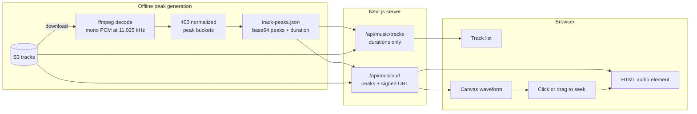
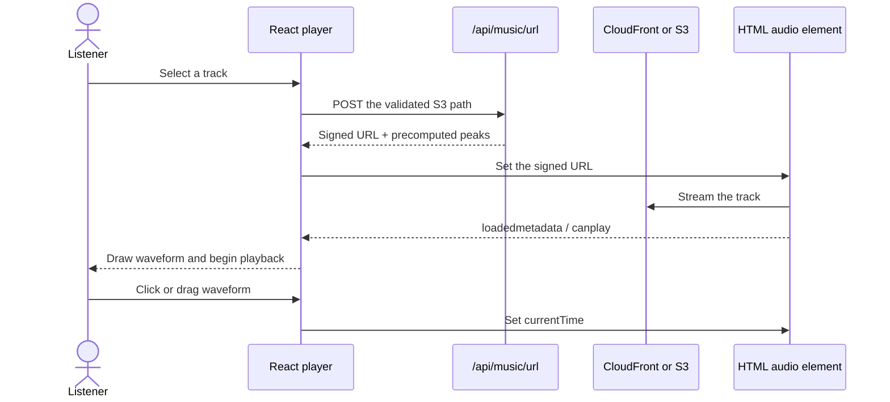

export const metadata = {
    title: 'Rebuilding My Music Page: SoundCloud-Inspired Waveforms and Neo-Brutalism',
    slug: 'rebuilding-my-music-page-with-soundcloud-inspired-waveforms',
    publishedAt: '2026-08-03',
    categories: ['nextjs', 'react', 'canvas', 'audio', 'ui-ux', 'neo-brutalism'],
    coverImage: '/images/blog/rebuilding-my-music-page-with-soundcloud-inspired-waveforms.webp',
    coverImageAlt: 'A neo-brutalist music player interface with an amber audio waveform on a dark background',
    author: {
        name: 'Akshay Gupta',
        avatar: '/images/blog-author.webp'
    },
    excerpt: 'How I rebuilt my portfolio music page around a SoundCloud-inspired waveform seeker, precomputed audio peaks, and a sharp neo-brutalist interface.'
}

In 2025, I wrote about [building the first version of my portfolio music player](/blog/building-a-music-showcase-for-my-portfolio-a-developer-s-journey). That player had real-time visualisations, a mini player, a fullscreen mode, a queue, and enough moving parts to feel like a tiny streaming app.

At the end of that post, I left myself a future idea: build a SoundCloud-inspired waveform that shows the shape of the entire track and lets the listener seek through it.

Turns out, I had accidentally written my own roadmap. 😄

The new [music page](/music) is a complete visual rebuild around that idea. The waveform is now the centre of the listening experience, the player stays within reach at the bottom of the viewport, and the whole thing speaks the same neo-brutalist language as the rest of this site.


## The idea behind the rebuild

My portfolio has never been just a list of technologies I know. I want it to feel like a small piece of me: engineering, music, experiments, opinions, and the occasional thing I built simply because I wanted it to exist.

Music and software scratch a similar itch for me. Both begin as an empty timeline. You arrange small pieces, listen or observe, remove what does not belong, and keep iterating until the whole thing feels right. The craft is not in adding the most layers. It is in knowing which layers earn their place.

That became the ideology behind this rebuild:

- **The interface should serve the music.** The waveform needed to be useful, not a decorative animation running in the background.
- **A personal site should feel personal.** Dropping in a generic player would work, but it would not say anything about how I design or build.
- **Complexity has to justify itself.** If a feature makes the page heavier without making listening better, it probably does not belong.
- **Infrastructure is part of the experience.** Fast playback, secure URLs, sensible bandwidth use, and graceful fallbacks are UX too, even when nobody sees them.

The result is smaller than the old player in some ways. I removed the fullscreen experience, the mini player, and the live analyser visualiser. In their place is one stronger interaction: the track itself expands into a timeline you can read, click, and scrub.

## Why a waveform?

A normal progress bar tells you where you are. A waveform gives you a small map of where you are going.

You can see the quiet intro, the first drop, the breakdown, and the dense final section before hearing them. That is one of the things I have always liked about SoundCloud's listening experience: time is not represented as an empty line. The shape of the audio becomes part of the interface.

I borrowed that idea, not the interface around it. My version needed to fit my own track list, queue behaviour, colour system, and responsive layout. When a track is selected, its row opens into a tall waveform with a reflected lower half. Playback progress fills the bars, hovering previews a timestamp, and dragging scrubs through the track. A second, slimmer waveform lives in the persistent player bar.


## The architecture

The music still lives in a private S3 bucket. The server lists the tracks, extracts metadata from the object names, and returns the catalogue to the browser. When a listener selects a track, a separate endpoint returns a one-hour signed CloudFront URL, with an S3 pre-signed URL as the fallback.

The new part is the waveform data. It follows a parallel path that begins offline instead of in the browser:



There are two API responses for a reason. Every track row needs a duration, so those small numbers travel with the initial listing. The much larger peak string is only returned for the selected track, alongside the signed audio URL the player already needs. That keeps the first response lean and avoids adding another request when playback starts.

## Generating the waveform without making the browser pay for it

My first player used the Web Audio API to draw a live visualiser. That works well when the goal is to show what is playing *right now*, but it does not give you the shape of the full track before playback reaches it.

To draw a complete waveform in the browser, I would need to fetch and decode the entire audio file. The `<audio>` element would then stream its own copy for playback. In other words, I would pay for the same track twice in CloudFront egress and make the listener wait for work that never changes.

The serverless runtime is not a good audio workstation either. It does not ship with a decoder such as ffmpeg, and decoding full tracks on demand would waste compute for a deterministic result.

So I moved the expensive work offline.

The `pnpm peaks:generate` script lists every track in S3, downloads up to four at a time, and asks ffmpeg to decode each file into mono, 32-bit float PCM at 11,025 Hz. It then divides the samples into 400 buckets and stores the loudest absolute sample in each bucket.

The final reduction is roughly this:

```javascript
for (let bucket = 0; bucket < 400; bucket++) {
  const samplesInBucket = samples.slice(start, end);
  peaks[bucket] = Math.max(...samplesInBucket.map(Math.abs));
}

for (let bucket = 0; bucket < 400; bucket++) {
  quantized[bucket] = Math.round((peaks[bucket] / loudest) * 255);
}

const encoded = Buffer.from(quantized).toString('base64');
```

Each amplitude becomes one byte instead of a floating-point number. Those 400 bytes are base64-encoded and committed to `track-peaks.json` with the exact duration. It is tiny, deterministic, cacheable data derived from the real track.

There is also a deliberately boring fallback. If I upload a new track and forget to regenerate the peaks, the player draws a flat placeholder strip. It does not invent a fake waveform. The audio still works, and the missing analysis is obvious enough for me to fix later.

## Drawing the seeker on canvas

Once the browser receives the base64 string, it converts each byte back into an amplitude between `0` and `1`. The waveform component then works out how many bars fit in the available width and samples the 400 buckets across them.

```typescript
const barCount = Math.floor(width / (barWidth + gap));

for (let i = 0; i < barCount; i++) {
  const peak = amplitudes[Math.floor((i * amplitudes.length) / barCount)];
  const barHeight = Math.max(2, peak * availableHeight);

  context.fillStyle = i / barCount <= progress ? played : idle;
  context.fillRect(x, baseline - barHeight, barWidth, barHeight);
}
```

I chose canvas because this is a dense, repeated graphic that redraws as playback and pointer position change. The canvas is scaled using `devicePixelRatio` so the bars remain sharp on high-density screens, and a `ResizeObserver` redraws it when the viewport or surrounding layout changes.

The tall row waveform uses the top 68% for the main envelope and mirrors a softer version underneath. The bottom player bar uses the same component with a slimmer configuration and no reflection. One renderer, two presentations.

Seeking is just a ratio:

```typescript
const ratio = (pointerX - bounds.left) / bounds.width;
audio.currentTime = ratio * audio.duration;
```

Pointer capture keeps drag-scrubbing alive even if the pointer slips outside the canvas. The same ratio positions the hover tooltip and divides the bars into played, hovered, and idle colours.

## From a click to audible playback

The waveform is the visible star, but the ordinary playback sequence still has to be reliable:



The React side is split across three hooks:

- `useAudioPlayback` owns the `<audio>` element state, time, duration, volume, mute, and seeking.
- `useQueueManager` handles the upcoming queue, reordering, and shuffle.
- `useKeyboardShortcuts` maps Space, arrow keys, and `M` without hijacking keys from inputs, the track list, or the accessible seeker.

The bottom player bar and queue drawer render into `<body>` through portals. They are viewport-level controls, so they should not become trapped by a positioned ancestor or lose their stacking order beneath the fixed navigation.

Small behaviour choices matter here. Selecting the current track toggles play instead of reloading it. Pressing previous after three seconds restarts the track; near the beginning it goes to the previous one. Volume and the last selected track survive a refresh in `localStorage`, but a restored track never starts playing without the listener asking it to.

## Neo-brutalism, briefly

The site was moving to a neo-brutalist visual system while I was rebuilding the player, and the music page became a good stress test for it.

The rules are intentionally strict: square corners, thick ink borders, hard unblurred offset shadows, solid surfaces, uppercase display type, and fast stepped transitions. Signal amber is the main accent; violet marks remixes and alternate states. On the dark theme the shadows flip to white, while on the light theme they become black, so the offset remains visible on both canvases.

This is more than adding chunky borders after the component is finished. The style changes how the interface communicates:

- The active track becomes an amber slab and physically steps away from the page on a hard shadow.
- The main play button is the loudest control because it deserves the strongest visual weight.
- Buttons move onto their own shadows when pressed, giving a mechanical response without a soft animation.
- The queue is a drawer with a clear edge, not a floating glass panel.
- Originals and remixes use blunt square labels that remain readable at a glance.

The UI is expressive, but the UX still has to stay quiet. Only the active track expands. Secondary actions stay out of the way. The persistent player keeps the essential controls reachable without turning the page into a dashboard.

 | 
:-------------------------:|:-------------------------:
The expanded track and compact player bar on mobile | The queue drawer sliding over the track list

## A canvas is not an accessibility tree

Canvas gave me the rendering model I wanted, but it is invisible to a screen reader and cannot receive keyboard range input by itself. I did not want mouse and touch users to get the real seeker while everyone else got a couple of skip buttons.

The component therefore includes a native `input[type='range']` with the same current time, duration, and seek handler. It stays visually hidden until keyboard focus reaches it, exposes an accessible label, and announces values such as `1:24 of 3:52`.

The track list also behaves like a listbox: Up and Down move between tracks, Home and End jump to the edges, and Enter or Space selects a track. Global player shortcuts ignore controls that already own those keys. That last detail prevents one Arrow Up press from moving track focus *and* changing the volume.

Accessibility is not a finishing coat. For a custom interaction like this, it has to be part of the component architecture.

## What I traded away

Precomputed peaks are not free magic. They introduce an offline step whenever the S3 library changes, and 400 buckets cannot capture every tiny transient in a long track. The data represents the envelope, not the exact PCM signal.

Those are good trade-offs for this page. Four hundred bars are more than the layout can display at most viewport sizes, one byte per bucket is wonderfully small, and the waveform exists to help someone navigate a song—not edit it at sample level.

I also stopped treating the player as a collection of modes. The old fullscreen and mini experiences were fun to build, but they duplicated controls and created more state to keep in sync. The fixed bottom bar now works on desktop and mobile, while the expanded row gives the selected track the visual space it needs.

Deleting features can feel less exciting than adding them. In this case, it made the product clearer.

## Things I learned

- **Precompute deterministic work.** If the answer only changes when the audio file changes, it does not belong in every listener's browser session.
- **Make one request carry its weight.** Returning peaks with the signed URL made the waveform ready without another network round trip.
- **Borrow interaction ideas, not entire products.** The SoundCloud-inspired timeline was the useful idea; the surrounding experience still needed to be mine.
- **Design systems are behavioural.** Square shapes and hard shadows matter, but hierarchy, motion, pressed states, and disclosure are what make the style coherent.
- **Removing code can improve the feature.** One strong waveform seeker replaced several visualiser modes and made the page easier to understand.

## Final thoughts

This rebuild brought the music page closer to what I wanted the portfolio to be in the first place: a place where the engineering does not hide the creative work, and the creative work gives the engineering a reason to exist.

The waveform is inspired by a familiar listening pattern, but everything around it—the offline peak pipeline, signed delivery, queue, keyboard behaviour, theme-aware canvas, and brutalist interaction language—was shaped for this site.

You can [try the player here](/music) or explore the implementation in the [portfolio repository](https://github.com/gupta-akshay/portfolio-v2).

Happy coding, and happy listening. 🎧
